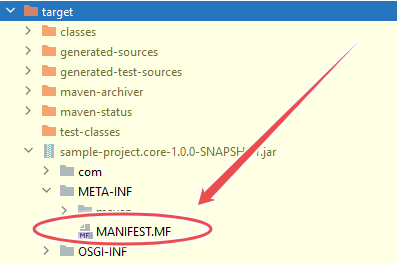
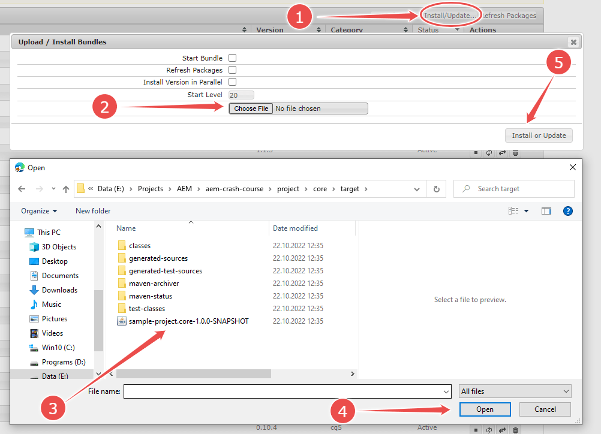
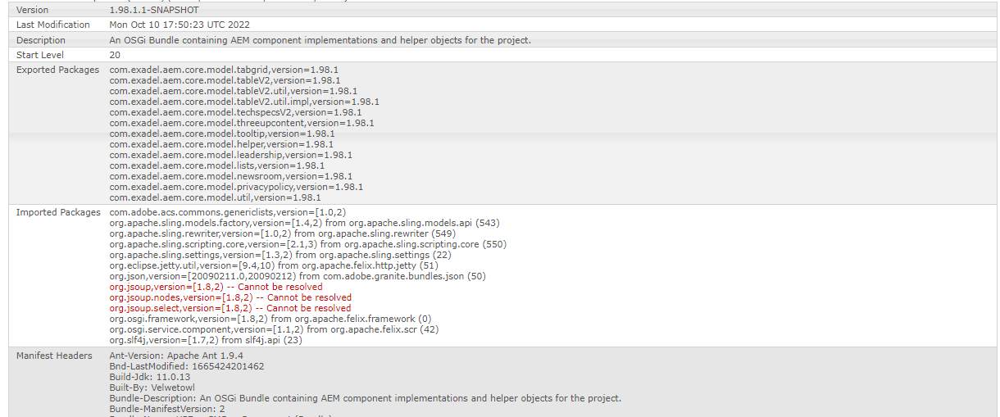

# AEM as an application server. OSGi bundles and services

## Working with bundles

In our previous lessons, we have been talking about reading data from the content storage and displaying it to users with AEM components. For sure, this is not the only thing AEM does. Technically, showing web pages is kind of the tip of an iceberg. It's time to understand what is going on a larger scale.

Storing, modifying and reading data is a facility that AEM provides. Displaying data in a convenient way is yet another facility. We can speak of them as some _applications_: units that implement business logic. 

There are more applications that perform special tasks: e.g., export data to different document types, collect user feedback, monitor website activities, compact data and retire obsolete chunks, etc. These applications work in parallel. Some are visible to users, some are tacit. They can interact, and many of them depend on others. The framework that binds them together is an _application server_.

The kind of application server built in AEM is [Apache Felix](https://felix.apache.org/documentation/index.html). Felix is very densely integrated into AEM and deeply affects the way it works. Frankly speaking, not so many people distinguish between "just AEM" and "Felix inside AEM".

Apache Felix is better known by the name of the standard it implements. Indeed, Felix is an implementation of **OSGi framework**. 

OSGi, also known as "Java dynamic module system", is a toolset for developing and deploying modular applications. The modules that we develop for AEM are known as _OSGi modules_, and services that power on modules are named _OSGi services_.

```mermaid
flowchart LR
    classDef subgraph_padding stroke:none, fill:none
    subgraph mod["Java project<br>for AEM"]
        subgraph mod-content[" "]
            m1["Module 1"]
            m2["Module 2"]
            mN["Module N"]
        end
    end
    subgraph aem["AEM Server"]
        subgraph aem-content[" "]
            subgraph bnd["OSGi container (Apache Felix)"]
                subgraph bnd-content[" "]
                    b1["Bundle (application) 1<br>#8213;#8213;#8213;<br>Service 1<br>Service 2<br>..."]
                    b2["Bundle (application) 2<br>#8213;#8213;#8213;<br>Service 1<br>Service 2<br>..."]
                    bN["Bundle (application) N<br>#8213;#8213;#8213;<br>Service 1<br>Service 2<br>..."]
                    bMore["...More bundles<br>(applications)"]
                    b2<.->b1
                    bN.->b1
                    bN.->b2
                end
            end
        end
    end
    m1-->b1
    m2-->b2
    mN-->bN
    class mod-content subgraph_padding
    class aem-content subgraph_padding
    class bnd-content subgraph_padding
    style bnd fill:#fff, stroke:none
```
There are dozens of OSGi modules. The amount of Java code responsible for working with JCR is just one. The HTTP server which supplies AEM pages is another. The latter depends on the module that parses and fulfills HTL scripts. It also depends on the engine that parses JSP and so on. The whole AEM is a mesh of separate modules.

### What is a bundle?

Talking about programming modules of AEM, we usually name them **bundles**. This is one of the most frequent terms in the whole AEM world.

A bundle is, technically, just a JAR file with a special meta-description - the _Manifest_. A bundle derives from your AEM project's Java module (there is always at least one, although there can be more. In the sample project, it is the ["core"](/project/core) module). 

What should you remember about a bundle?

* It is created with the intent of better modularization of your AEM project;
* It can be deployed to an AEM server, installed, restarted, uninstalled, and deleted independently from other bundles;
* At the same time, it relates to other bundles; it exports Java packages (not every, but only specific "truly public" packages); also, it requires other bundles' packages - all via its `MANIFEST.MF` file;
* A bundle is isolated from other bundles in terms of the classpath (different bundles can have classes with the same paths and names. Classes from different bundles do not "see" each other unless exported via `MANIFEST.MF`).

As you read this, you might catch that _deja vu_ feeling. This sounds much like the notion of _Java modules_ - those added in Java 9. The idea is generally the same. The gist is that the OSGi architecture has been there since the early 2000s, and it has powered AEM since mid-2000s. Brand new Java modules just showed up too late to join the party. In AEM, we use bundles.

<details>
<summary><em style="color:#aaa; font-weight: bold">Deeper understanding a bundle (click to expand)</em></summary>

<b>Why does your _core_ module compile into a bundle?</b> 

There is a Maven plugin responsible for this. In the sample project, this is _maven-bundle-plugin_ (there exist alternatives as well).

```xml
<plugin>
    <groupId>org.apache.felix</groupId>
    <artifactId>maven-bundle-plugin</artifactId>
    <version>5.1.2</version>
    <configuration>
        <exportScr>true</exportScr>
        <instructions>
            <Import-Package>javax.inject;javax.annotation;version=0.0.0,*;resolution:=optional</Import-Package>
            <Sling-Model-Packages>com.exadel.aem.core.models</Sling-Model-Packages>
            <Export-Package>com.exadel.aem.core.*</Export-Package>
            <_dsannotations>*</_dsannotations>
            <_metatypeannotations>*</_metatypeannotations>
        </instructions>
    </configuration>
    <executions>
        <execution>
            <id>generate-scr-metadata</id>
            <goals>
                <goal>bundle</goal>
                <goal>manifest</goal>
            </goals>
        </execution>
    </executions>
</plugin>
```

All this plugin (or a similar one) does is composes the `MANIFEST.MF` file and, optionally, puts additional resources into the JAR file.

You can find `MANIFEST.MF` in the compiled JAR file under the _target_ folder:



... and it reads like this:
```
Manifest-Version: 1.0
Created-By: Apache Maven Bundle Plugin
Build-Jdk-Spec: 11
Bnd-LastModified: 1665185525517
Build-Jdk: 11.0.13
Bundle-Description: Core bundle for Sample AEM Project
Bundle-ManifestVersion: 2
Bundle-Name: Sample AEM Project - Core
Bundle-SymbolicName: com.exadel.aem.sample-project.core
Bundle-Version: 1.0.0.SNAPSHOT
Export-Package: com.exadel.aem.core.models;uses:="org.apache.sling.api,o
 rg.apache.sling.api.resource,org.apache.sling.models.annotations";versi
 on="1.0.0"
Import-Package: javax.inject;version="0.0.0",javax.annotation;version="0
 .0.0",org.apache.sling.api;resolution:=optional;version="[2.3,3)",org.a
 pache.sling.api.resource;resolution:=optional;version="[2.12,3)",org.ap
 ache.sling.models.annotations;resolution:=optional;version="[1.5,2)",or
 g.apache.sling.models.annotations.injectorspecific;resolution:=optional
 ;version="[1.1,2)",org.apache.sling.models.factory;resolution:=optional
 ;version="[1.4,2)"
Require-Capability: osgi.ee;filter:="(&(osgi.ee=JavaSE)(version=11))"
Sling-Model-Packages: com.exadel.aem.core.models
Tool: Bnd-5.1.1.202006162103
```
You can learn about the sections of `MANIFEST.MF` and what they are for in [this document](https://www.vogella.com/tutorials/OSGi/article.html#the-manifest-file-manifest-mf).

<b>How is the manifest created?</b>

The _maven-bundle-plugin_ scans Java classes of the current module, processes annotations, and extracts info to put in the manifest. Also, it adds some data from the plugin's config (such as the name of a Sling Models package). You don't have to create a manifest by hand - you just provide proper annotations (such as `@Model`) and adequate plugin config.

<b>Ways to deal with JAR files without a manifest</b>

Only JAR files with a manifest can be installed as parts of the AEM's application container. However, some functionality you need may come from a 3rd-party library that does not have an OSGi manifest. Such libraries as Apache Commons, Jackson, Jsoup, etc., do not have manifests. That's why they speak of "OSGi-ready" and "non-OSGi-ready" libraries.

How should we deal with the latter? 

Sometimes an OSGi-ready variant of a library can still be found, although not as famous as a "usual" one.

Other times they suggest that you insert a non-OSGi-ready JAR dependency inside the OSGi-ready artifact that you build out of your project. This is achieved quite easily: add the following line in your _maven-bundle-plugin_ config:

```
<configuration>
    <instructions>
        <!-- ... -->
        <Embed-Dependency>*;scope=compile</Embed-Dependency>
    </instructions>
</configuration>
```
If the needed library is a Maven dependency in the compile scope, it will just be embedded. <small>The wildcard here is for any dependency. Instead, you may specify a concrete artifact ID or several ones, comma-separated.</small>

<small>Else, you can turn a foreign JAR file into an OSGi-compliant library by creating and embedding a manifest by hand. See explanation [here](https://dev.lucee.org/t/how-do-i-convert-an-existing-jar-file-into-an-osgi-bundle/374). We don't fairly recommend this approach, though.</small>
</details>

### Life cycle of a bundle

A bundle can be delivered to an AEM server in several ways:
- with a POST request to the installation endpoint 
```
curl -u admin:admin -F action=install -F bundlestartlevel=20 -F 
    bundlefile=@"name of jar.jar" http://<aem_host>:<aem_port>/system/console/bundles
```
- or manually via the Felix Console at `http://<aem_host>:<aem_port>/system/console/bundles`



But most often it is installed together with the package. Usually, it is the package created out of the _ui.apps_ module, or else the package for the _all_ module. This is for uniformity. The content of a package and the content of the same project's bundle are interrelated, so it is convenient to ship them together. 

The _filevault-package-maven-plugin_ (or its analog) puts the bundle's JAR file into the `/apps/<project_name>/install` folder of the future package. Next, the content is zip-packed and deployed to the server. By convention, any JAR file that sits in `/apps/<project_name>/install` automatically unrolls as a bundle upon installation of the package itself.

> Find the config for _filevault-package-maven-plugin_ [in your sample project](/project/all/pom.xml).

When already in an AEM instance, a bundle is in one of the following states:
- *installed* - just got to the AEM instance but cannot start because some required dependencies are not found;
- *resolved* - the dependencies are OK, and the bundle is ready to be started;
- *starting* - a temporary state that the bundle goes through while starting;
- *active* - the bundle is running. This is the most common state;
- *stopping* - a temporary state that the bundle goes through while stopping;
- *uninstalled* - the bundle is gone;
- *fragment* - a "technical" status for bundles that are actually OSGi fragments (they supplement other bundles).

You can observe the statuses of different bundles in the same Felix console at `http://<aem_host>:<aem_port>/system/console/bundles`:


Most of the bundles you'll see are in the _active_ state. However, if your AEM server behaves weirdly or looks broken, look for bundles in the _installed_ or _resolved_ state. Those _resolved_ you may try to kick-start with a click on the small "▶" button. It usually helps.

But it won't help with those just _installed_. They are indeed sick, and that is most probably due to some dependencies not resolved (or, in other words, some packages cannot be imported). You can know it for sure if you click on the bundle title and expand the details block. Then you can see some red lines pointing to unresolved dependencies:



<details>
<summary><em style="color:#aaa; font-weight: bold">Dealing with unresolved dependencies (click to expand)</em></summary>

A bundle can start when it is able to reach all the stuff listed in the `Import-Packages` section of `MANIFEST.MF`. Notably, the required packages must not just be there but also have particular versions like `[2.12,3)` (reads: "a version from 2.12, inclusive, up to 3, exclusive). 

These limitations come from Maven analyzing the `pom.xml` file, exactly its "dependencies" section. There are some dependencies declared as _provided_. That is, you expect them to be present on the server. Maven converts these "expectations" into the `Inported-Packages` content. If you were mistaken expecting a particular item to be provided, the "cannot be resolved" error is just around the corner.

So, the first thing you must do is revise your dependencies. Try to search the `/system/console/bundles` page for the name of the dependency that you need and that is reported missing. It might still be there but with a different version. Then you can just amend the version in `pom.xml`.

Otherwise, it is not there. The `org.jsoup` thing in the screenshot above is just that case. Often this is due to the dependency being a non-OSGi-ready one. Then you can consider changing the scope to _provided_ and making sure the appropriate JAR file embeds into the bundle of your own as we discussed above.

Yet another option is adding the following to _maven-bundle-plugin_:
```xml
<configuration>
    <instructions>
        <!-- ... -->
        <Import-Package>*;resolution:=optional</Import-Package>
        <!-- "*" means "any package at all". You can narrow down the instruction
        to a particular package, like "org.jsoup;resolution:=optional" -->
    </instructions>
</configuration>
```
Thus you instruct the OSGi framework that missing a dependency is not a blocker for the bundle to start. Be careful, though. It makes little sense ignoring the absence of a class if you are going to use it. This will only lead to the likes of `ClassNotFoundException` later on. 

The optional resolution makes sense if you don't even have an idea what the red-colored packages in the _Felix Console_ are. In this case, they are probably _transitive dependencies_ (own dependencies of a dependency of yours). Chances are that your code could live without them. At least, you can try.  

Quite often, the _Felix Console_ shows in red the packages from another bundle of yours. It means that this other bundle could not start in its own turn. You need to locale that bundle and try to troubleshoot it. As you succeed, chances are that both your bundles will be up and running.
</details>

### Manual operations with a bundle

Sometimes you will need to restart a bundle. It helps to refresh all the services that are inside. There is not a single button for that. Instead, you need to click the ⏹ button, then wait a couple of seconds (stopping is not imminent), refresh the page, find the same bundle and click ▶ which will appear instead of ⏹.

There are also HTTP POST commands for respectively stopping and starting a bundle:
```
curl -u admin:admin http://<aem_host>:<aem_port>/system/console/bundles/<name_of_bundle> -F action=stop

curl -u admin:admin http://<aem_host>:<aem_port>/system/console/bundles/<name_of_bundle> -F action=start
```

You may need to manually delete a bundle as well. Do this with the "🗑" button. Same operation can be performed via the HTTP POST endpoint with a command like the following:
```
curl -u admin:admin -daction=uninstall http://<aem_host>:<aem_port>/system/console/bundles/<name_of_bundle>
```
---

[Continue reading](part2.md)

[To Contents](../../README.md)
