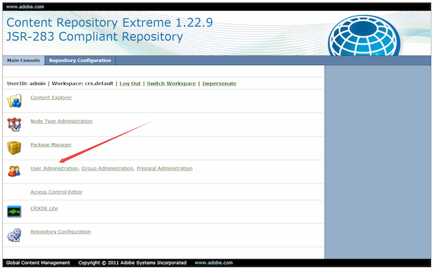
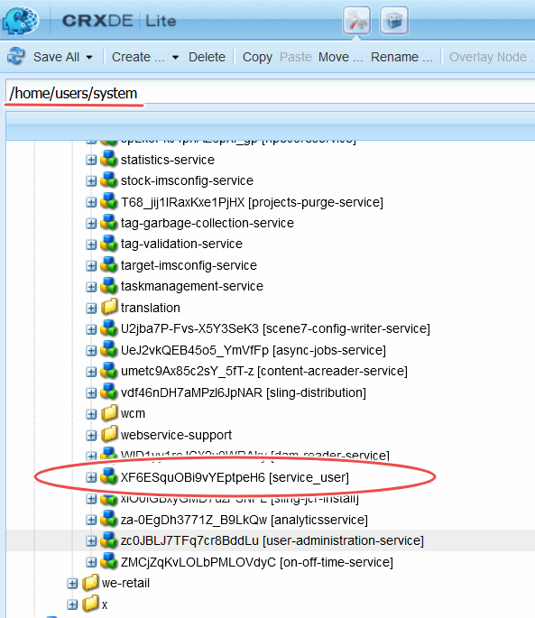
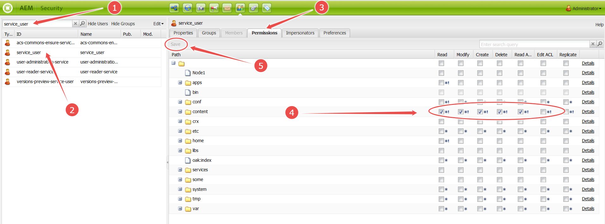
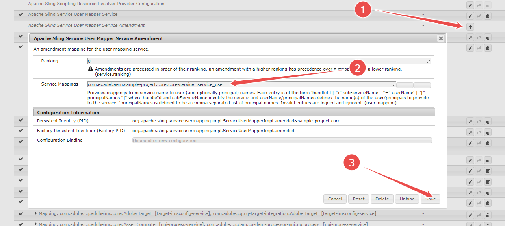
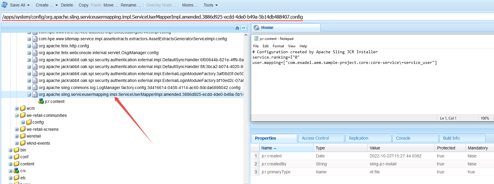

## Working with the content repository with a Service

In the lesson on [Sling models](../2.7/part2.md), we mentioned that data manipulations are sometimes performed from a service, not a user request. An often use-case is retrieving some info and storing it into JCR so that it could be rendered in the site's pages later on. Else, services are responsible for maintenance tasks (updating content, e.g., dates; removing obsolete content, etc.)

In situations like those, a service must impersonate a user. The right to modify or delete content does not come for granted. The service must initiate a data access session and, eventually, close it. 

_Session_, however, is rather a low-level entity. The thing that services actually work with is _ResourceResolver_.

Previously we used to speak that in a Sling model, one should neither create nor discard a _ResourceResolver_ because the Sling framework does this automatically. Things are different in services.

To create an instance of _ResourceResolver_, one needs:
* A system user with access rights to the necessary nodes;
* A service mapping;
* And a reference to _ResourceResolverFactory_.

### Creating a system user

Technically, there can be a separate user for every service (or at least a group of services). This would allow setting up access rights with precision. In real life, however, they usually create one system user per project (library).

The system user is created manually. You need to visit `http://<aem_server>:<aem_port>/crx/explorer/index.jsp`, then click "User Administration":



In the window that pops up, click "Create System User". Enter the user name (you may leave the "Intermediate Path" box empty) and click the small "Accept" button:


Now you can find the newly created user in CRX/DE:



### Assigning rights to the service user

If your service is going to read or store data, it must act on behalf of a non-default user. This user should be given necessary rights. There are different ways to do it. The most straightforward one is to assign rights by hand.

Navigate to `http://<aem_server>:<aem_port>/useradmin`. Enter the name of the service user in the top left corner field. Switch to the "Permissions" tab and check the boxes you need.



(We do not disclose the user/rights management in full detail. For a deeper reference read [this Adobe's document](https://experienceleague.adobe.com/docs/experience-manager-65/administering/security/security.html?lang=en).)

A user is also a resource. Technically, you can pull it into the code base. Many projects (especially distributable libraries) do this to make sure that the concrete user is always present on a server. Create the same-named folder in a content package (such as _ui.content_) and import the `.content.xml` file that describes the user; then add the folder to the module's `filter.xml` and also to Git.

You can also store in your project the read/write permissions for a folder. Have you noticed `rep:policiy` nodes here and there in CRX/DE? This is where user rights (for exactly the parent node of this `rep:policy` node) are stored. So, you can pull these nodes into the code base as well. 


Must be said, this approach is not fairly recommended. Instead, they create dedicated content packages ("ACL packages") that are distributed across instances. You can read about ACL packaging [here](http://www.aemcq5tutorials.com/tutorials/create-system-user-in-aem/#package-system-user:~:text=How%20to%20package%20system%20user%20using%20acs%20commons%20acl%20packager).   

### Creating a service mapping

The next step is to map the system user to the services of your bundle.

Navigate to the Felix configuration console at `http://<aem_server>:<aem_port>/system/console/configMgr` and find the config by the name _"Apache sling Service User Mapper Service Amendment"_. This is a factory config, so there is the "plus" button. Now click it and create a new mapping. It has the following format:
```
<bundle_ID>:<subservice_name>=<user_name>
```
_Bundle ID_, or else the bundle's symbolic name, can be looked up in the `MANIFEST.MF`. E.g., for the _core_ module of our sample project, it is `com.exadel.aem.sample-project.core`.

The _subservice name_ is an arbitrary token that you create yourself. The word does not matter. There can be a single subservice name for all your mappings, or else different tokens for different kinds of operations like _"service-read"_, _"service-write"_, etc.

> In our sample project this token reads `core-service` ([see here](/project/ui.config/src/main/content/jcr_root/apps/sample-project/osgiconfig/config/org.apache.sling.serviceusermapping.impl.ServiceUserMapperImpl.amended~sample-project-core.xml)).

The _user name_ is the name of the system user you have created.



Note: you can define multiple mappings in the same window. Separate them with commas.

Now that you have saved the new mapping, you can find it in CRX/DE under the "system settings" node:



You will definitely want to have this mapping in your project's code base. Create a new XML file in your _ui.config_ project under the `config` folder and give it a name like `org.apache.sling.serviceusermapping.impl.ServiceUserMapperImpl.amended~sample-project-core.xml`. 

The first part of the name is the fully qualified name of the Apache Sling service we modify the config for. `.amended` is a conventional token by which we mark a config extension. The `~sample-project-core` part is just a custom word describing the bundle for which the mapping is created. 

The content of the file will look like 
```xml
<?xml version="1.0" encoding="UTF-8"?>
<jcr:root xmlns:sling="http://sling.apache.org/jcr/sling/1.0"
          xmlns:jcr="http://www.jcp.org/jcr/1.0"
          jcr:primaryType="sling:OsgiConfig"
          user.mapping="[com.exadel.aem.sample-project.core:core-service=service_user]"
/>
```

> Find the ready file in our sample project [here](../../project/ui.config/src/main/content/jcr_root/apps/sample-project/osgiconfig/config/org.apache.sling.serviceusermapping.impl.ServiceUserMapperImpl.amended~sample-project-core.xml).
 
### Creating and discarding a ResourceResolver

Finally, we are ready to use the _ResourceResolverFactory_. Consider the following code:
```java
@Component
public class MyServiceImpl implements MyService {

    private static final Map<String, Object> AUTHENTICATION_INFO = Collections.singletonMap(
            ResourceResolverFactory.SUBSERVICE,
            "core-service");

    @Reference
    private ResourceResolverFactory resourceResolverFactory;
    
    @Override
    public void execute() {
        try (ResourceResolver resourceResolver = 
                     resourceResolverFactory.getServiceResourceResolver(AUTHENTICATION_INFO)) {
            Resource contentResource = resourceResolver.getResource("/content");
            Resource newResource = resourceResolver.create(
                    contentResource,
                    "child",
                    Map.of(
                            JcrConstants.JCR_PRIMARYTYPE, JcrConstants.NT_UNSTRUCTURED,
                            JcrConstants.JCR_TITLE, "New child resource"

                    ));
            resourceResolver.commit();
        }
    }
}
```
First, we declare a static argument map which is needed to initialize the _ResourceResolver_. The map mentions `core-service` - this is the service token we used in the mapping config.

The main activity is however going inside the `execute()` method. The new _ResourceResolver_ is created from the `resourceResolverFactory` service with the above map. The _ResourceResolver_ is then used to retrieve a common content root. Afterward, it creates a new child resource. The three arguments passed to the `create()` method are the parent resource, the name of the child, and the properties that will form the value map of the child. Finally, the _ResourceResolver_ commits the changes. Otherwise, they will not be actually stored.

> Please learn the sample projects' [AlbumSaverImpl](/project/core/src/main/java/com/exadel/aem/core/services/impl/AlbumSaverImpl.java). In this service, we create several pages with `PageManager` (which words much like `ResourceResolver`), and also create and modify resources. Each set op operations over a single resource tree ends with `commit()`.

<u>Very important</u>: a _ResourceResolver_ created in code must be manually closed. Not closing a _ResourceResolver_ is a frequent reason for a memory leak. That's why they recommend to introduce _ResourceResolver_ with _try-with-resources_ as in the sample above.

> In real-world projects, they often move the logic of creating resource resolvers to a utility class. Another approach you may see [in our sample project](/project/core/src/main/java/com/exadel/aem/core/services/impl/ResourceResolverHostImpl.java) where a resource resolver is served by a special OSGi component and works in the auto-closeable manner.

---

[Continue reading >>](part3.md)

[<< Previous part](part1.md)

[To Contents](../../README.md)
