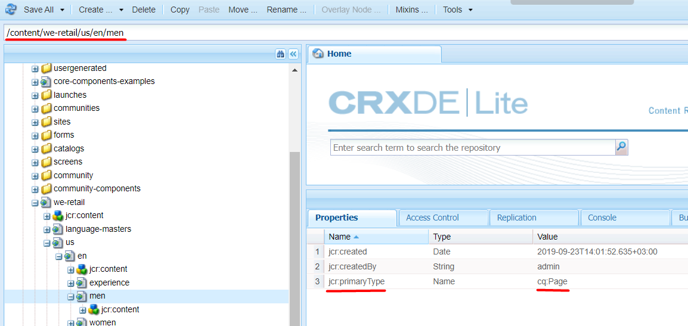
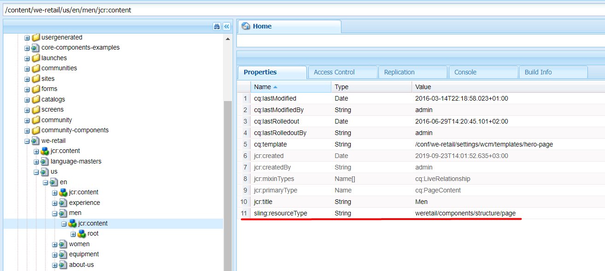
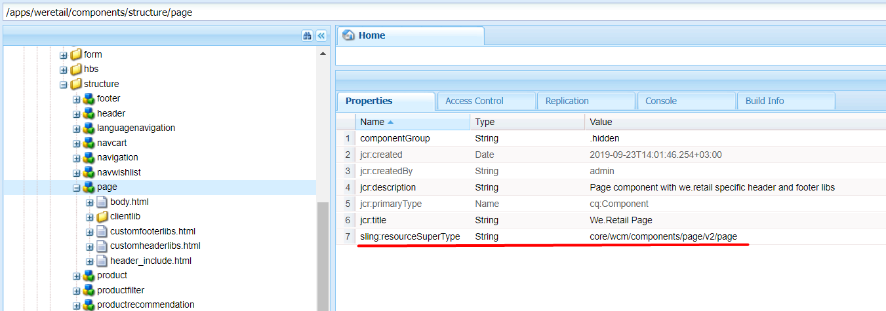

# 7. Rendering Page with Components

## Introduction

As we remember from the previous AEM lessons, everything is stored as structured content in JCR. JCR content is stored in the form of nodes containing properties with values. Sling refers to these nodes as  Resources. Resources and their properties are used in AEM components to render the UI on the web pages.

Sling is a web framework, so it renders data via HTTP requests. As we start to process a URL, first we must find out what content object (resource) it corresponds to. Then the engine picks up the rendering script that matches this particular object. And finally, the script renders the content as an HTML document, XML, JSON, etc. This provides excellent support for web content authors to build pages which are easily customized to their requirements.

Since Sling is the request-processing engine of AEM, the web addresses that AEM uses are often called "Sling URLs'. These URLs have some peculiarities. An experienced AEM developer can often tell whether a website runs AEM or not, from just looking at the URL. Also, Sling URLs are quite complex.

Let us "decompose" a Sling URL, that is, identify its parts.

## Sling URL decomposition

Imagine you are the Sling engine. You've been given an address like http://www.example.com/products/product1.one.two.html/a/b?a=b
How do you treat it?
1. First, identify the ordinary-looking parts: the scheme (protocol), the host name, and optionally the port.
2. Then comes the path. Path most often maps to a node in JCR (== to a Resource in Sling). But not always. There could be a Servlet that is declared for this path. For existing resources the resource path ends at the first dot in the request url.
3. Extension - The extension is the part of the request URL after the last dot. It is used to select the script to render the resource. The extension is separated from the resource path by a dot.
4. Selectors - Everything between the resource path and the extension is selectors string. Selectors are a list of strings separated by dots and are used to specify the script to render the resource. The selectors are separated from the resource path, extension and each other by a dot.
5. Suffix - The suffix is the part of the request URL after the extension. It is used to pass additional information to the script. The suffix is separated from the extension by a slash.
6. Query parameters - The query parameters are the part of the request URL after the question mark. They are used to pass additional information to the script. The query parameters are separated from the suffix by a question mark.

http://www.example.com/products/product1.one.two.html/a/b?a=b

| protocol | host            | resource path     | selectors | extension | suffix | params |
|----------|-----------------|-------------------|-----------|-----------|--------|--------|
| http://  | www.example.com | products/product1 | one.two   | html      | a/b    | a=b    |

## Rendering a page with components

To better understand the process of rendering a page with components, let's break down the rendering of this page http://localhost:4502/content/we-retail/us/en/men.html.

Sling takes a unique approach to handle requests in that a request URL is first resolved to a resource, then based on the resource it selects the actual servlet or script to handle the request.

Resources are the central part of Sling, they represent the resource addressed by any request URL. It is the resource that is first resolved when handling a request. Based on the resource, a servlet or script is then accessed actually to handle the request.

For our URL http://localhost:4502/content/we-retail/us/en/men.html, the longest matching URL before the first "." will be our resource path. In our case, it should be /content/we-retail/us/en/men We will now hit this resource in the repository

As you can see, this resolves to a cq:Page. So the next thing Sling will look for is a content node (jcr:content). If that is not found, an error will be thrown. A page resource is only valid if it has the below structure:

```text
page
  -jcr:primaryType:cq:Page
  jcr:content
    -jcr:primaryType:cq:PageContent
```

Now let's go to the jcr:content node. Sling will look for a property called sling:resourceType. This is the property that defines what (or better say where) is the renderer for this node. So for the page /content/we-retail/us/en/men  the sling:resourceType is wknd/components/structure/page


Sling will look for the resources first under /apps and then under /libs


For the resource /apps/wknd/components/structure/page Sling will look for the best match as below if we don’t have any selectors in our request:
1. page.html
2. html.html
3. If none of the files mentioned above are present in your component, and it has a sling:resourceSuperType, then Sling will go and take a look at that component in a similar manner to find if any script can be resolved to render content.
4. GET.html

In our example, the best match is sling:resourceSuperType. So we go to /apps/core/wcm/components/page/v2/page.


In /apps/core/wcm/components/page/v2/page the best match for us is page.html.


We see that our script page.html uses different scripts, to render included scripts Sling first goes to the CHILD component (/apps/wknd/components/structure/page - in our case), checks if the file is there and then looks at PARENT component (/apps/core/wcm/components/page/v2/page - in our case). 

For example, we have head.html and footer.html under /apps/wknd/components/structure/page (CHILD) and /apps/core/wcm/components/page/v2/page (PARENT), Sling uses files under /apps/wknd/components/structure/page (CHILD) to render the page.

As you know, page is just one type of component that involved other components, rendering the rest components under the http://localhost:4502/content/we-retail/us/en/men.html has the same approach that we discussed above.

## Rendering resources from JCR as HTML, JSON or XML.

In order to display a node by the required render you just need to provide a correct view (extension). Most often we need to display the content in HTML format, we use the .html extension.

The default servlet is selected if no servlet or script for the current resource type is found. The default servlet is the Sling Default GET Servlet. It provides a default rendering for resources in the form of JSON or XML. In order to render a resource as JSON or XML, just add .json or .xml extension in the URL. For example, to render the resource /content/we-retail/us in JSON, you can open the URL http://localhost:4502/content/we-retail/us.json.

AEM also supports developing and deploying custom Sling renderers to take full control of the rendered schema and content. Developers can access Servlet resolver console /system/console/servletresolver and check which servlet is responsible for rendering a path.

## Default Sling POST Servlet. Storing data in JCR by address.

Sling default POST Servlet (also called the SlingPostServlet) is one of the options to modify content in Sling. It is the default handler for all POST requests that gives you the ability to create, modify, delete, copy and move nodes in the repository.

When users perform authoring actions in AEM, such as creating a page, adding a component, or modifying a component, the SlingPostServlet is used to store the data in the JCR. The resource path is used to determine the location in the JCR where the data is stored, and the request parameters are used to determine the data that is stored/modified.

You can read the full documentation for the SlingPostServlet [here](https://sling.apache.org/documentation/bundles/manipulating-content-the-slingpostservlet-servlets-post.html).

## The most important attributes JCR nodes / Sling resources: jcr:primaryType, sling:resourceType, sling:resourceSuperType and their values.

`jcr:primaryType` is a special property. All nodes have `jcr:primaryType` property. Depending on the `jcr:primaryType` of the current node, you will or will not be able to add specific properties to the current node, or create child notes of specific types. E.g., you cannot create a node of type `cq:Page` under the parent node of type `nt:unstructured`. You cannot create `nt:unstructured` under `nt:folder`. However, you are able to create `nt:unstructured` under `sling:Folder`, and so on. This property is protected, it cannot be removed or changed by the application using the UI.

`sling:resourceType` property contains a path, which is used by the Sling to find the appropriate Servlet or Script to handle the request for the resource. The path can be absolute or relative (omitting `/apps/` or `/libs/`. This mechanism offers more freedom than one in which the script accesses the data entities (as an SQL statement in a PHP script would do) because a resource can have several renditions. If multiple scripts apply for a given request, the script with the best match is selected.

`sling:resourceSuperType` is used to achieve inheritance. When set, it inherits the specified component to this component, allowing us to override some of the scripts.

---

[To Contents](../../../README.md)
